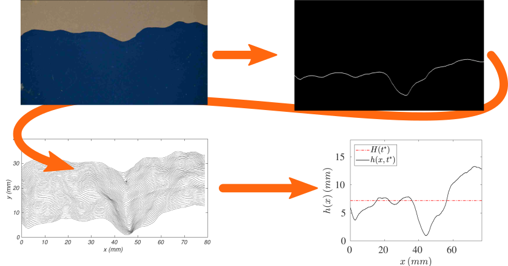
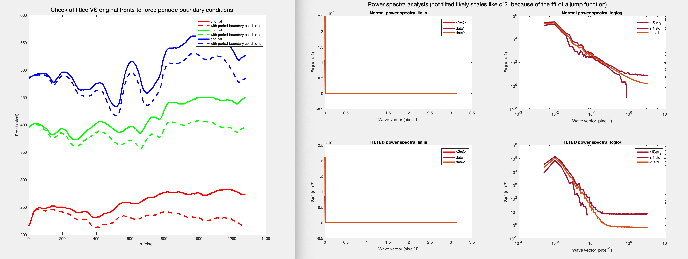
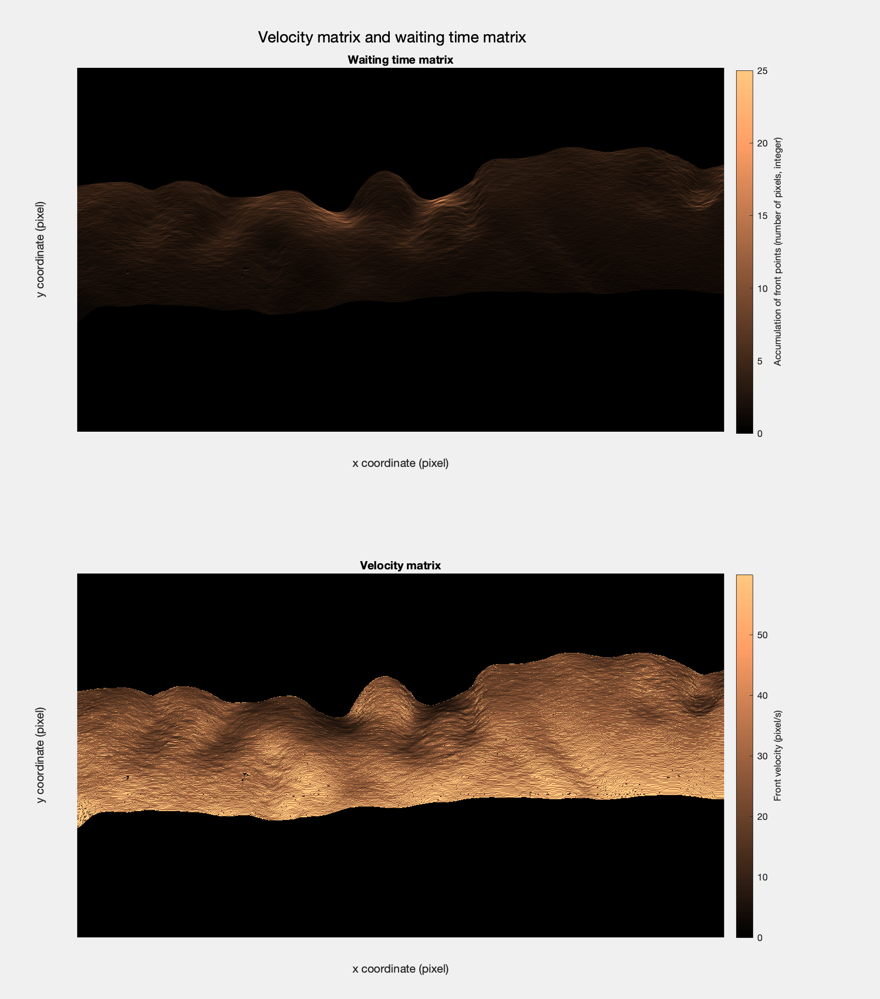

# 2-dimensional fronts of fluids: a Matlab code to analyse them and extract their statistical properties

This repository is a Matlab code to binarize and further analyse fronts of liquids in 2D.
It's a cleaned up version of the code I developed during my bachelor's thesis at the Universita' degli Studi di Milano, under the supervision of professor A. Vailati and doctor M. Carpineti.

The aim of this piece of code is to 'binarize' a RGB video of a 2D front and extract the front h(x). 
The variable h(x) contains the height, in pixel, of the front of a single frame. This is then repeated for every single frame, leading to the matrix h(x, t), whose size 1 is the width fo the frame and whose size 2 is the number of frames of the video.
The code also gets the 'waiting time amatrix', W, which is a cumulative sum of all the binarized frames of the video.

Optionally, the code allows to crop the video in space or in time 'interactively', quite an handy feature, or to speed it up of a certain factor (handy for presentations).

### Input
a video of a 2d front that evolves in time, or better the relative path to it. Test videos are in ./vid/xxx.avi.
### Options:
* Verbose = true/false; if true, print and plot a lot of very usefull stuff to check if the binarization of the video is correct. Set it to ture the first time you use the code. 
* Reload = true/false; if true, reload the front matrix h(x, t) and other variables from the appropriate .mat file stored in ./fronts/xxx/xxx/.mat              

### Output:
* the binarized video that contains the front only, in ./vid/xxx_bin.xxx
* a vector h(x) with the front, that evolves in time and is stored like a 2d matrix h(x, t); the waiting time matrix W and their x and t vector; the parameters of the video (path, VideoReader object, etc) stored as a small class  named p. All these variables are saved in ./fronts/xxx/xxx.mat
* optional: a video cropped in space, in ./vid/xxx_c.avi
* optional: a video cropped in time, in ./vid/xxx_ct.avi
* optional: a video speeded up of a factor, f, in ./vid/xxx_speedup_fx.avi; mainly for presentations purposes
* optional: plotting of the h(x, t), averaged in different ways, and W; The plots are also saved in a .pdf in ./vid/xxx/xxx.pdf

### Code structure:
* class VideoAnalysis.m: main class that does everything. Call the different methods of the class to binarize the video, cropt it interactively in space and/or time, save the binarize video and the front h(x,t) and do the power spectra analysis
* a test_main file to test the VideoAnalysis class, where you will find examples on how to use it
* in /vid/*.avi folder there are 2 videos to be used as a test

### Notes:
* binarization is done with ''imbinarize'' using 'global' method; may not work for your case, if so tweak it till works.
* a violent "bwareaopen' function is applied, with a connectivity parameter of 20 000 or so. This works great to remove everything that is not the front itself, but may fail for your own specific video. If so, tweak it.
* edge detection is done with the ''edge'' function of Matlab, using the standard 'sobel' method. Works for my video, but it might fail in your case; if so, tweak it till it works.
* if tweaking the above 3 points does not make it work, maybe the problem is in the video: contrast and illumination must be already good to be able to analyse them
* may fail on Windows due to wrong paths (/ instad of backslash, tested on Linux and Mac only)
* there is currently no background subtraction 
* it works only for RGB videos. For videos taken in grayscale you will have to manually remove all the "rgb2gray()" functions present in the code.
* output are quite heavily compressed .avi videos. The code is not designed/tested on .tiff or more scientific/compressionless formats.

### Usage example
With Verbose = true, you can call binarize_video() and you will see all the different stages of the binarization steps, for the first, middle, last frames (here only the last one):
 

The binarization interface, when Verbose = true,  spits out when the front has more than one "1" pixel; if so, it will take the average:
 

You can plot the fronts h(x, t), either all toghether (waiting time matrix and time overlay) or looking at the space averaged or time average quantities:

You can call 'compute_and_plot_power_spectrum()' to plot the spatial power spectra, averaged over the whole video, of the front.
It can reveal characteristic length scales and power law behaviours, but to obtain meaningful scaling the front must be continuos, i.e. there must be no jump between the left and right extrema of it. A jump will give an artificial power law behaviour S(q) ~ q^-2, which is its Fourier transform.
The fix is implemented by "tilting" the front, substracting the appropriate linear slope, as you can appreciate in the plot:

Finally you can plot the "waiting time matrix", which is simply the accumulation of the front in all frames of the video, and its kind of inverse, the "velocity matrix", which is obtained by inverting every non-zero point of the waiting time matrix and multipling it by the frame rate of the video:

This is the handy interactive cropping of the video (it plots first middle last frames):

This is the handy cropping in time of the video, based on the frame number:

### TODO/bugs
* the 'get_pixel_density()' is not implemented 
* spatial correlation functions and return probabilities are not implemented
* the binarization will fail if the front is missing in the first column of any frame. This is because if the front in a certain column is missing, it will be replaced by the value of the previous column. A better way would be some kind of runnning average on first or second neighbours columns.

Tags: imbibition, image processing and binarization, fluid front analysis, 2d front extraction, power spectra, waiting time matrix, correlation function, statistical physics, KPZ equation

